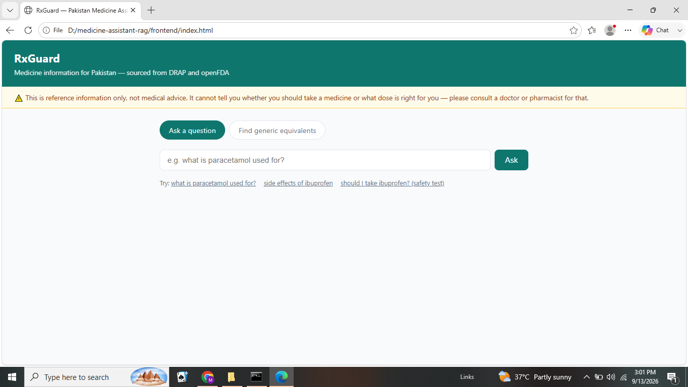
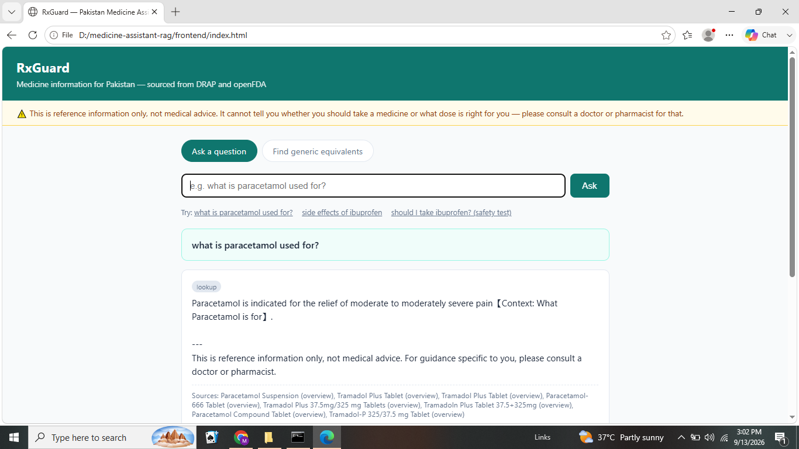
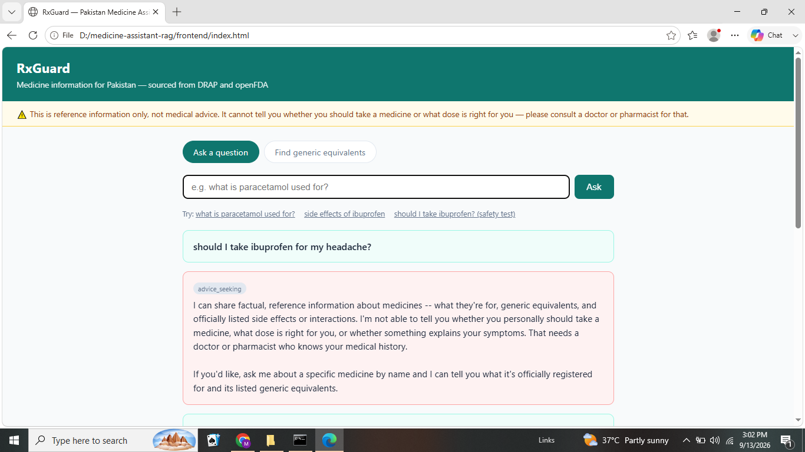
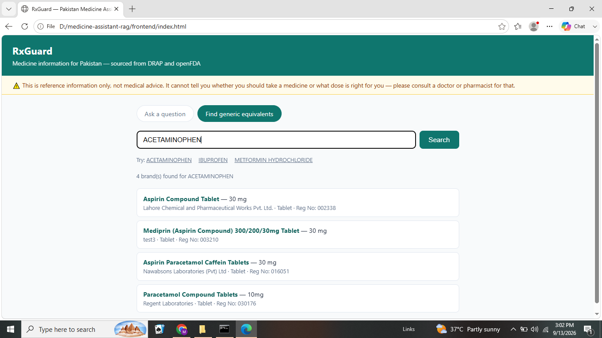

# Pakistan Medicine Assistant (RxGuard)

A RAG-based medicine information assistant for Pakistan, combining official
drug registration data from **DRAP** (Drug Regulatory Authority of Pakistan)
with clinical reference data from **openFDA**, to answer factual questions
about registered medicines — what they're for, their generic equivalents,
and their officially listed side effects/interactions.

**This is a reference tool, not a medical advice replacement.** It never
gives personalized dosing advice or tells someone whether they should take
a medicine — that boundary is enforced architecturally (see "Safety
design" below), not just with a disclaimer.

## Why this project

Built to fill a gap: prior projects (crop price forecasting, used-car price
prediction, AQI forecasting) were all classical ML/data pipelines with no
LLM/GenAI component, despite targeting ML/AI Engineer roles. This is the
first RAG project, built end-to-end in a compressed timeframe.

## Architecture

```
DRAP scraper ──┐
               ├──> Composition parser ──> openFDA matcher ──> Chroma index
openFDA API ───┘                                                    │
                                                                      ▼
User query ──> Safety classifier ──┬──> [advice-seeking] ──> canned refusal
                                    ├──> [out-of-scope]    ──> canned refusal
                                    └──> [lookup] ──> retrieve ──> Groq generate ──> answer
```

**Data pipeline** (`src/scraper`, `src/matching`, `src/indexing`):
1. Scrape DRAP's registered-products database (reverse-engineered two
   undocumented endpoints via browser DevTools — see "Data investigation"
   below) for a curated list of ~80 common generic medicines.
2. Parse each drug's free-text composition field into structured
   ingredients.
3. Match each active ingredient against openFDA's drug label API to pull
   indications, warnings, contraindications, and drug interactions.
4. Chunk each drug record by content type (overview / warnings /
   interactions) and embed into a local ChromaDB vector store.

**Query pipeline** (`src/safety`, `src/rag`, `src/api`):
1. Every query first passes through a **safety classifier** — a
   rule-based regex pass (high-recall, catches personalized-advice
   phrasing like "should I take X") followed by an LLM classifier
   (Groq) for the lookup-vs-out-of-scope distinction.
2. Personalized-advice and out-of-scope queries **never reach retrieval
   or generation** — they return a fixed canned response. This is a hard
   architectural gate, not a prompt instruction the model could ignore.
3. Lookup queries retrieve relevant chunks from ChromaDB and generate a
   grounded answer via Groq, constrained to only use the retrieved
   context (never outside knowledge), with a safety footer appended to
   every response regardless of content.

## Data investigation

Before writing any code, I investigated whether DRAP's data was actually
accessible (structured downloads vs. scraping needed) — same approach used
on a prior project (AMIS Punjab mandi price scraping):

- DRAP's registry (`eapp.dra.gov.pk`) has no bulk download. Found two
  undocumented endpoints via DevTools: a GET autocomplete search and a POST
  detail-by-registration-number endpoint.
- DRAP's separate MRP (price) portal turned out to be a broken OData/IIS
  service on their end (confirmed via a raw ASP.NET config error exposing
  their server's file path) — still down after multiple days of checking.
  **Pricing/affordability ranking is not implemented in v1** as a result;
  equivalents are listed unranked. This is an external outage, not a gap
  in the scraping approach.
- DRAP's data has no indication/side-effect field at all — it's
  registration metadata only (composition, company, dates). openFDA fills
  that gap, joined on active ingredient name.

## A safety bug caught during QA (worth reading)

During manual testing, an answer about ibuprofen's side effects included
symptoms like "new primary malignancies" and "interstitial lung disease" —
warnings that don't belong to ibuprofen at all. Investigation traced this to
the openFDA fuzzy-matching fallback: it had matched an Ibuprofen product to
**Trametinib**, an unrelated chemotherapy drug, because openFDA's non-exact
substance search returned a loosely-relevant result with no verification
step.

A full audit of the dataset found **105 of 564 matches (19%) had the same
class of problem** — including Cetirizine matched to a homeopathic
combination remedy across 4 separate records, and Ranitidine matched to
Glimepiride (an unrelated diabetes drug).

Fix: added a plausibility guard rejecting any match with no name overlap
between the queried ingredient and the matched substance, then re-validated
every existing match against it. Invalidated matches become "no data
available" rather than wrong data — a deliberate trade-off, since for a
medical-information tool, an honest gap is safe and a wrong answer is not.

## Known limitations (v1 scope)

- **Curated dataset, not exhaustive**: covers ~80 common generic medicines
  (~1,270 DRAP records) rather than DRAP's full ~130,000-registration
  catalog, due to a hard project deadline. A brute-force full scraper
  exists (`drap_scraper.py`) and can be run to completion separately
  (~38 hours at a polite rate limit).
- **No price-based ranking** of generic equivalents (DRAP's MRP portal is
  currently non-functional server-side — see above).
- **~19% of ingredient matches were removed** after the safety audit above
  rather than risk serving unverified clinical data; those drugs return
  DRAP registration info only, no indication/warnings/interactions.
- **Retrieval isn't always precise** — vector search occasionally ranks
  unrelated chunks highly for a given query. The generation step is
  constrained to only answer from retrieved context, so this produces an
  honest "I don't have that information" rather than a wrong answer, but
  it does mean some in-scope questions get an unnecessary non-answer.
- No live public deployment — see "Deployment note" below for why, and
  "Running it locally" for the full setup (backend + browser frontend).

## Screenshots

<!-- Add screenshots here after running the app locally, e.g.: -->




## Running it locally

This project runs entirely on your own machine — clone it, follow these steps,
and you'll have a working local web app (FastAPI backend + browser frontend).

```bash
git clone <this-repo-url>
cd rxguard
pip install -r requirements.txt
cp .env.example .env   # add your free Groq API key from console.groq.com
```

**Start the backend:**

```bash
cd src/api
uvicorn main:app --reload --port 8000
```

Confirm it's running at http://localhost:8000/docs.

**Open the frontend:**

Just open `frontend/index.html` directly in your browser (double-click it, or
right-click → Open with → your browser). It's a single static file with no
build step, already configured to talk to `http://localhost:8000`. If your
browser has any issue loading it as a local file, alternatively serve it:

```bash
cd frontend
python -m http.server 3000
# then open http://localhost:3000
```

**(Optional) Rebuild the data pipeline from scratch** — the repo already
includes the pre-built dataset and vector index, so this is only needed if
you want to reproduce the scraping/matching process yourself:

```bash
cd src/scraper && python curated_scraper.py
cd ../matching && python match_openfda.py && python revalidate_matches.py
cd ../indexing && python build_index.py
```

## Deployment note

Live hosting was attempted but intentionally not pursued to completion: Hugging
Face Spaces moved Docker deployment behind a paywall shortly before this was
built, and both Render and Koyeb's free tiers required credit card
verification for this account despite documentation stating otherwise (both
platforms use risk-based fraud detection that can trigger this regardless of
actual usage). Given a hard deadline, the deliberate choice was a robust,
fully-documented local setup over gambling further time on unpredictable
third-party infrastructure policies — a real engineering trade-off, not an
oversight.

## Tech stack

Python, FastAPI, ChromaDB, sentence-transformers (local embeddings, no API
cost), Groq (Llama-based generation, free tier), BeautifulSoup + requests
for scraping.
